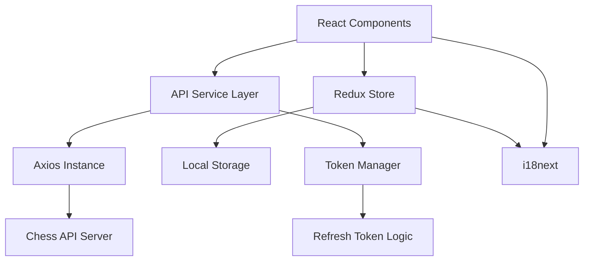
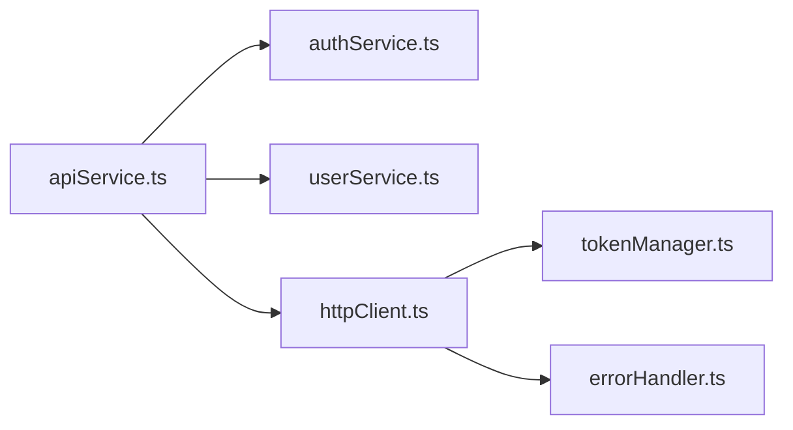

# Design Document

## Overview

This design implements API integration for the chess application using Axios, focusing on user authentication and profile management. The solution provides a centralized API service layer with automatic token management, error handling, and seamless integration with existing Redux state and i18next internationalization.

## Architecture

### High-Level Architecture



### API Service Layer Structure



## Components and Interfaces

### 1. HTTP Client Configuration

**File:** `src/services/httpClient.ts`

- Configured Axios instance with base URL
- Request interceptors for authentication headers
- Response interceptors for token refresh and error handling
- Automatic retry logic for failed requests

### 2. Token Management

**File:** `src/services/tokenManager.ts`

- JWT token storage and retrieval
- Automatic token refresh using refresh tokens
- Token expiration detection
- Session cleanup on logout

### 3. Authentication Service

**File:** `src/services/authService.ts`

- Login functionality with credential validation
- Logout with session cleanup
- Token refresh management
- Authentication state checking

### 4. User Profile Service

**File:** `src/services/userService.ts`

- Profile data retrieval
- Profile updates (language, chess set, avatar, etc.)
- User settings synchronization

### 5. Redux Integration

**Enhanced Settings Slice:** `src/store/settingsSlice.ts`

- API-synced user preferences
- Language and chess set management
- Profile data caching
- Optimistic updates with rollback

### 6. Enhanced Login Page

**File:** `src/pages/LoginPage/LoginPage.tsx`

- Form validation and submission
- Error handling and display
- Loading states
- Redirect after successful login

### 7. Enhanced Settings Page

**File:** `src/pages/SettingsPage/SettingsPage.tsx`

- Profile data display and editing
- Language selection with immediate application
- Chess set selection with preview
- Avatar customization
- Save/cancel functionality

## Data Models

### Authentication Types

```typescript
interface LoginRequest {
  username: string;
  password: string;
}

interface AuthResponse {
  access_token: string;
  refresh_token: string;
  expires_in: number;
  token_type: string;
  session_id: string;
  user: User;
}

interface RefreshTokenRequest {
  refresh_token: string;
}
```

### User Profile Types

```typescript
interface User {
  id: string;
  email: string;
  username: string;
  name?: string;
  role: "admin" | "teacher" | "student";
  profile?: UserProfile;
  created_at: string;
  updated_at: string;
}

interface UserProfile {
  id: string;
  gender?: "male" | "female" | "other" | "prefer_not_to_say";
  avatar?: "avatar1" | "avatar2" | "avatar3";
  avatarHat?: "avatarHat1" | "avatarHat2";
  avatarWear?: "avatarWear1" | "avatarWear2" | "avatarWear3";
  age?: number;
  language?: "he" | "en" | "ar" | "ru";
  chessSet?: "chessSet1" | "chessSet2" | "chessSet3" | "chessSet4";
  created_at: string;
  updated_at: string;
}

interface UpdateProfileRequest {
  email?: string;
  username?: string;
  name?: string;
  profile?: Partial<UserProfile>;
}
```

### Redux State Enhancement

```typescript
interface SettingsState {
  language: string;
  chessSet: string;
  user?: User;
  isAuthenticated: boolean;
  loading: boolean;
  error?: string;
}
```

## Error Handling

### Error Types and Responses

1. **Authentication Errors (401)**

   - Trigger automatic token refresh
   - Redirect to login if refresh fails
   - Clear stored credentials

2. **Validation Errors (400)**

   - Display field-specific error messages
   - Prevent form submission
   - Highlight invalid fields

3. **Rate Limiting (429)**

   - Display rate limit message
   - Implement exponential backoff
   - Disable login form temporarily

4. **Network Errors**

   - Show offline message
   - Retry failed requests
   - Cache requests for later

5. **Server Errors (500)**
   - Display generic error message
   - Log error details
   - Provide retry option

### Error Message Internationalization

All error messages will be translated using i18next keys:

```typescript
const errorMessages = {
  "auth.invalid_credentials": t("auth.invalid_credentials"),
  "auth.rate_limited": t("auth.rate_limited"),
  "network.offline": t("network.offline"),
  "profile.update_failed": t("profile.update_failed"),
};
```

## Testing Strategy

### Unit Tests

1. **API Service Tests**

   - Mock Axios responses
   - Test error handling scenarios
   - Verify token management logic

2. **Redux Integration Tests**

   - Test action creators and reducers
   - Verify state updates
   - Test middleware functionality

3. **Component Tests**
   - Test form validation
   - Test error display
   - Test loading states

### Integration Tests

1. **Authentication Flow**

   - End-to-end login process
   - Token refresh scenarios
   - Logout functionality

2. **Profile Management**
   - Settings page interactions
   - Profile update workflows
   - Language/chess set changes

### API Mocking Strategy

Use Mock Service Worker (MSW) for consistent API mocking:

```typescript
// Mock handlers for development and testing
const handlers = [
  rest.post("/user/login", (req, res, ctx) => {
    return res(ctx.json(mockAuthResponse));
  }),
  rest.get("/user/profile", (req, res, ctx) => {
    return res(ctx.json(mockUserProfile));
  }),
];
```

## Security Considerations

### Token Security

1. **Storage**: Use secure storage for refresh tokens
2. **Transmission**: HTTPS only for all API calls
3. **Expiration**: Implement proper token rotation
4. **Cleanup**: Clear tokens on logout/error

### Request Security

1. **Headers**: Include proper security headers
2. **Validation**: Client-side input validation
3. **CSRF**: Include CSRF protection if needed
4. **Rate Limiting**: Respect API rate limits

## Performance Optimizations

### Caching Strategy

1. **Profile Data**: Cache user profile in Redux
2. **Settings**: Sync with localStorage for offline access
3. **API Responses**: Implement response caching where appropriate

### Request Optimization

1. **Debouncing**: Debounce profile update requests
2. **Batching**: Batch multiple setting changes
3. **Lazy Loading**: Load profile data only when needed

### Bundle Optimization

1. **Code Splitting**: Separate API services into chunks
2. **Tree Shaking**: Remove unused API endpoints
3. **Compression**: Minimize API service bundle size
