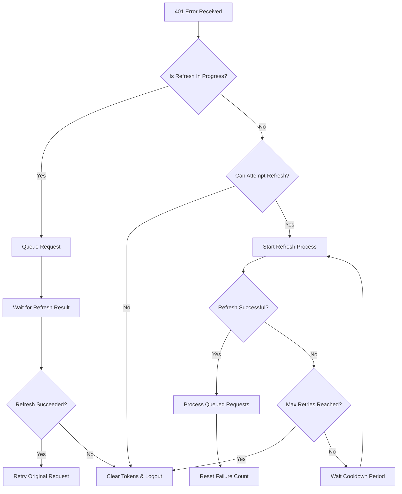

# Design Document

## Overview

The current authentication system has a critical flaw in the token refresh mechanism that causes infinite loops when refresh tokens expire. The issue stems from the HTTP client interceptor attempting to refresh tokens on every 401 response without proper state management or circuit breaker patterns.

The solution involves implementing a centralized token refresh manager with request queuing, retry limits, and proper error handling to prevent infinite loops while maintaining a smooth user experience.

## Architecture

### Current Issues Identified

1. **Circular Dependency**: HttpClient imports AuthService dynamically, creating potential race conditions
2. **No Request Queuing**: Multiple simultaneous 401 errors trigger multiple refresh attempts
3. **No Retry Limits**: Failed refresh attempts don't have circuit breaker logic
4. **Poor Error Recovery**: System doesn't gracefully handle expired refresh tokens

### Proposed Architecture

```
┌─────────────────┐    ┌──────────────────┐    ┌─────────────────┐
│   HTTP Client   │───▶│ Token Refresh    │───▶│  Auth Service   │
│   Interceptor   │    │    Manager       │    │                 │
└─────────────────┘    └──────────────────┘    └─────────────────┘
         │                       │                       │
         │                       ▼                       │
         │              ┌──────────────────┐             │
         └─────────────▶│ Request Queue    │◀────────────┘
                        │   Manager        │
                        └──────────────────┘
                                 │
                                 ▼
                        ┌──────────────────┐
                        │ Token Manager    │
                        │   (Enhanced)     │
                        └──────────────────┘
```

## Components and Interfaces

### 1. TokenRefreshManager

A new centralized service to handle all token refresh logic with proper state management.

```typescript
interface TokenRefreshManager {
  // Core refresh functionality
  refreshToken(): Promise<boolean>;

  // State management
  isRefreshInProgress(): boolean;
  canAttemptRefresh(): boolean;

  // Request queuing
  queueRequest(request: PendingRequest): Promise<any>;

  // Circuit breaker
  recordFailure(): void;
  resetFailureCount(): void;

  // Cleanup
  clearRefreshState(): void;
}

interface PendingRequest {
  originalRequest: AxiosRequestConfig;
  resolve: (value: any) => void;
  reject: (error: any) => void;
}

interface RefreshState {
  isRefreshing: boolean;
  failureCount: number;
  lastFailureTime: number;
  pendingRequests: PendingRequest[];
}
```

### 2. Enhanced TokenManager

Extend the existing TokenManager with additional state tracking.

```typescript
interface EnhancedTokenManager extends TokenManager {
  // Refresh attempt tracking
  getRefreshAttemptCount(): number;
  incrementRefreshAttempts(): void;
  resetRefreshAttempts(): void;

  // Session state
  markSessionExpired(): void;
  isSessionExpired(): boolean;

  // Token validation
  validateTokenStructure(token: string): boolean;
}
```

### 3. Updated HttpClient Interceptor

Simplified interceptor that delegates to TokenRefreshManager.

```typescript
interface HttpClientInterceptor {
  handleAuthError(
    error: AxiosError,
    originalRequest: AxiosRequestConfig
  ): Promise<any>;
  shouldAttemptRefresh(error: AxiosError): boolean;
}
```

## Data Models

### RefreshState Model

```typescript
interface RefreshState {
  isRefreshing: boolean;
  failureCount: number;
  lastFailureTime: number;
  maxRetries: number;
  cooldownPeriod: number;
  pendingRequests: PendingRequest[];
}
```

### AuthError Model

```typescript
interface AuthError extends ApiError {
  isTokenExpired: boolean;
  isRefreshTokenInvalid: boolean;
  shouldLogout: boolean;
  retryAfter?: number;
}
```

## Error Handling

### Circuit Breaker Pattern

1. **Failure Threshold**: Maximum 3 refresh attempts per session
2. **Cooldown Period**: 30 seconds between failed attempts
3. **Automatic Reset**: Reset failure count on successful refresh

### Error Classification

```typescript
enum AuthErrorType {
  TOKEN_EXPIRED = "TOKEN_EXPIRED",
  REFRESH_TOKEN_INVALID = "REFRESH_TOKEN_INVALID",
  NETWORK_ERROR = "NETWORK_ERROR",
  SERVER_ERROR = "SERVER_ERROR",
}
```

### Error Recovery Flow



## Testing Strategy

### Unit Tests

1. **TokenRefreshManager Tests**

   - Test refresh state management
   - Test request queuing functionality
   - Test circuit breaker logic
   - Test error handling scenarios

2. **Enhanced TokenManager Tests**

   - Test refresh attempt tracking
   - Test session expiration handling
   - Test token validation

3. **HttpClient Interceptor Tests**
   - Test 401 error handling
   - Test request retry logic
   - Test integration with TokenRefreshManager

### Integration Tests

1. **Token Refresh Flow Tests**

   - Test successful token refresh
   - Test failed token refresh with fallback
   - Test multiple simultaneous requests

2. **Error Scenario Tests**

   - Test expired refresh token handling
   - Test network error during refresh
   - Test server error responses

3. **Circuit Breaker Tests**
   - Test failure threshold enforcement
   - Test cooldown period behavior
   - Test automatic reset functionality

### Manual Testing Scenarios

1. **Infinite Loop Prevention**

   - Simulate expired refresh token
   - Verify system stops after max retries
   - Confirm user is redirected to login

2. **Concurrent Request Handling**

   - Make multiple API calls simultaneously
   - Verify only one refresh attempt is made
   - Confirm all requests are processed correctly

3. **User Experience Testing**
   - Test session expiration during normal usage
   - Verify smooth transition to login page
   - Test re-authentication flow

## Implementation Phases

### Phase 1: Core Infrastructure

- Implement TokenRefreshManager
- Enhance TokenManager with state tracking
- Add comprehensive logging

### Phase 2: HTTP Client Integration

- Update HTTP client interceptor
- Implement request queuing
- Add circuit breaker logic

### Phase 3: Error Handling Enhancement

- Improve error classification
- Add user-friendly error messages
- Implement graceful logout flow

### Phase 4: Testing and Validation

- Comprehensive unit test coverage
- Integration testing
- Manual testing scenarios
