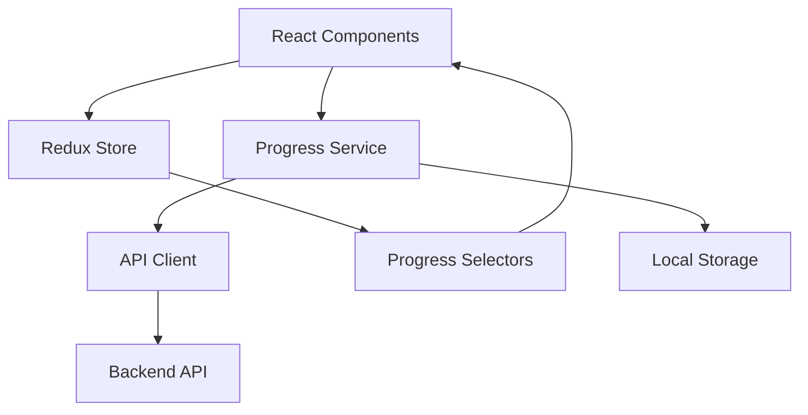

# Design Document

## Overview

The progress API integration system will provide a comprehensive solution for tracking user completion across different sections of the chess application. The system will integrate with existing Redux state management, handle API operations efficiently, and provide visual feedback for completed tasks.

## Architecture

### High-Level Architecture



### Component Layer

- React components will consume progress data through Redux selectors
- Components will dispatch actions to update progress
- Visual indicators will be rendered based on progress state

### Service Layer

- Progress service will handle API operations and business logic
- Service will manage deduplication and data transformation
- Service will coordinate between API and Redux store

### State Management Layer

- Redux store will maintain current progress state
- Actions and reducers will handle progress updates
- Selectors will provide computed progress data to components

## Components and Interfaces

### Progress Service Interface

```typescript
interface ProgressService {
  fetchUserProgress(): Promise<ProgressRecord[]>;
  createProgress(data: CreateProgressRequest): Promise<ProgressRecord>;
  updateProgress(
    id: string,
    data: UpdateProgressRequest
  ): Promise<ProgressRecord>;
  getProgressByCategory(category: ProgressCategory): ProgressRecord | null;
  isTaskCompleted(category: ProgressCategory, taskId: string): boolean;
}
```

### Redux Store Structure

```typescript
interface ProgressState {
  records: Record<string, ProgressRecord>;
  loading: boolean;
  error: string | null;
  initialized: boolean;
}

interface ProgressRecord {
  id: string;
  user: UserInfo;
  type: ActivityType;
  category: ProgressCategory;
  completed: string[];
}
```

### API Client Interface

```typescript
interface ProgressApiClient {
  getProgress(): Promise<ProgressRecord[]>;
  createProgress(data: CreateProgressRequest): Promise<ProgressRecord>;
  updateProgress(
    id: string,
    data: UpdateProgressRequest
  ): Promise<ProgressRecord>;
  getProgressById(id: string): Promise<ProgressRecord>;
}
```

### Visual Indicator Component

```typescript
interface CompletionIndicatorProps {
  isCompleted: boolean;
  size?: number;
}

const CompletionIndicator: React.FC<CompletionIndicatorProps>;
```

## Data Models

### Core Types

```typescript
type ProgressCategory =
  | "how_to_move"
  | "how_to_play"
  | "mate-in-one"
  | "mate-in-two"
  | "basic-tactics"
  | "labyrinth";

type ActivityType = "tutorial" | "game";

interface CreateProgressRequest {
  userId: string;
  type: ActivityType;
  category: ProgressCategory;
  completed: string[];
}

interface UpdateProgressRequest {
  type: ActivityType;
  category: ProgressCategory;
  completed: string[];
}

interface UserInfo {
  id: string;
  email: string;
  username: string;
  name: string;
}
```

### Category Mapping

```typescript
const CATEGORY_MAPPING: Record<string, ProgressCategory> = {
  "/how-to-move": "how_to_move",
  "/how-to-play": "how_to_play",
  "/puzzles/mate-in-one": "mate-in-one",
  "/puzzles/mate-in-two": "mate-in-two",
  "/puzzles/basic-tactics": "basic-tactics",
  "/puzzles/labyrinth": "labyrinth",
};
```

## Error Handling

### API Error Handling Strategy

1. **Network Errors**: Retry mechanism with exponential backoff
2. **Authentication Errors**: Redirect to login or refresh token
3. **Validation Errors**: Display user-friendly error messages
4. **Server Errors**: Fallback to cached data when possible

### Error Recovery Mechanisms

```typescript
interface ErrorHandlingStrategy {
  retryAttempts: number;
  retryDelay: number;
  fallbackToCache: boolean;
  userNotification: boolean;
}
```

### Offline Support

- Cache progress data in localStorage
- Queue API operations when offline
- Sync when connection is restored

## Testing Strategy

### Unit Testing

1. **Progress Service Tests**

   - API integration tests
   - Data transformation tests
   - Deduplication logic tests

2. **Redux Tests**

   - Action creators tests
   - Reducer tests
   - Selector tests

3. **Component Tests**
   - Visual indicator rendering tests
   - Progress display tests
   - User interaction tests

### Integration Testing

1. **API Integration Tests**

   - End-to-end API flow tests
   - Error handling tests
   - Authentication integration tests

2. **Redux Integration Tests**
   - Store integration tests
   - Component-store interaction tests

### Test Data Management

```typescript
const mockProgressData: ProgressRecord[] = [
  {
    id: "test-id-1",
    user: mockUser,
    type: "tutorial",
    category: "how_to_move",
    completed: ["1", "2"],
  },
];
```

## Implementation Details

### Progress Service Implementation

The progress service will be implemented as a singleton class that manages all progress-related operations:

```typescript
class ProgressServiceImpl implements ProgressService {
  private apiClient: ProgressApiClient;
  private store: Store;

  async fetchUserProgress(): Promise<ProgressRecord[]> {
    const records = await this.apiClient.getProgress();
    const deduplicated = this.deduplicateRecords(records);
    this.store.dispatch(setProgressRecords(deduplicated));
    return deduplicated;
  }

  private deduplicateRecords(records: ProgressRecord[]): ProgressRecord[] {
    const categoryMap = new Map<ProgressCategory, ProgressRecord>();

    records.forEach((record) => {
      const existing = categoryMap.get(record.category);
      if (!existing) {
        categoryMap.set(record.category, record);
      } else {
        // Merge completed arrays and use most recent ID
        const mergedCompleted = [
          ...new Set([...existing.completed, ...record.completed]),
        ];
        categoryMap.set(record.category, {
          ...record,
          completed: mergedCompleted,
        });
      }
    });

    return Array.from(categoryMap.values());
  }
}
```

### Redux Implementation

```typescript
// Actions
const progressSlice = createSlice({
  name: "progress",
  initialState,
  reducers: {
    setProgressRecords: (state, action) => {
      state.records = action.payload.reduce((acc, record) => {
        acc[record.category] = record;
        return acc;
      }, {});
      state.initialized = true;
    },
    updateProgressRecord: (state, action) => {
      const { category, record } = action.payload;
      state.records[category] = record;
    },
    setLoading: (state, action) => {
      state.loading = action.payload;
    },
    setError: (state, action) => {
      state.error = action.payload;
    },
  },
});

// Selectors
export const selectProgressByCategory =
  (category: ProgressCategory) => (state: RootState) =>
    state.progress.records[category];

export const selectIsTaskCompleted =
  (category: ProgressCategory, taskId: string) => (state: RootState) => {
    const record = state.progress.records[category];
    return record?.completed.includes(taskId) ?? false;
  };
```

### Visual Indicator Implementation

```typescript
const CompletionIndicator: React.FC<CompletionIndicatorProps> = ({
  isCompleted,
  size = 20,
}) => {
  if (!isCompleted) return null;

  return (
    <CompletionIndicatorWrapper size={size}>
      <CheckIcon />
    </CompletionIndicatorWrapper>
  );
};

const CompletionIndicatorWrapper = styled.div<{ size: number }>`
  position: absolute;
  top: 0;
  left: 0;
  width: ${(props) => props.size}px;
  height: ${(props) => props.size}px;
  background-color: #4caf50;
  border-radius: 50%;
  display: flex;
  align-items: center;
  justify-content: center;
  z-index: 1;
`;

const CheckIcon = styled.div`
  width: 12px;
  height: 12px;
  background-image: url("data:image/svg+xml;base64,PHN2ZyB3aWR0aD0iMTIiIGhlaWdodD0iMTIiIHZpZXdCb3g9IjAgMCAxMiAxMiIgZmlsbD0ibm9uZSIgeG1sbnM9Imh0dHA6Ly93d3cudzMub3JnLzIwMDAvc3ZnIj4KPHBhdGggZD0iTTEwIDNMNC41IDguNUwyIDYiIHN0cm9rZT0id2hpdGUiIHN0cm9rZS13aWR0aD0iMiIgc3Ryb2tlLWxpbmVjYXA9InJvdW5kIiBzdHJva2UtbGluZWpvaW49InJvdW5kIi8+Cjwvc3ZnPgo=");
  background-size: contain;
  background-repeat: no-repeat;
  background-position: center;
`;
```

### Initialization Flow

```typescript
// App initialization
useEffect(() => {
  const initializeProgress = async () => {
    try {
      const userId = selectUserId(store.getState());
      if (userId) {
        await progressService.fetchUserProgress();
      }
    } catch (error) {
      console.error("Failed to initialize progress:", error);
    }
  };

  initializeProgress();
}, []);
```

### Task Completion Flow

```typescript
const handleTaskCompletion = async (
  category: ProgressCategory,
  taskId: string
) => {
  try {
    const existingRecord = progressService.getProgressByCategory(category);

    if (!existingRecord) {
      // Create new progress record
      await progressService.createProgress({
        userId: getUserId(),
        type: "tutorial",
        category,
        completed: [taskId],
      });
    } else {
      // Update existing record
      const updatedCompleted = [
        ...new Set([...existingRecord.completed, taskId]),
      ];
      await progressService.updateProgress(existingRecord.id, {
        type: existingRecord.type,
        category,
        completed: updatedCompleted,
      });
    }
  } catch (error) {
    // Handle error appropriately
    showErrorNotification("Failed to save progress");
  }
};
```
