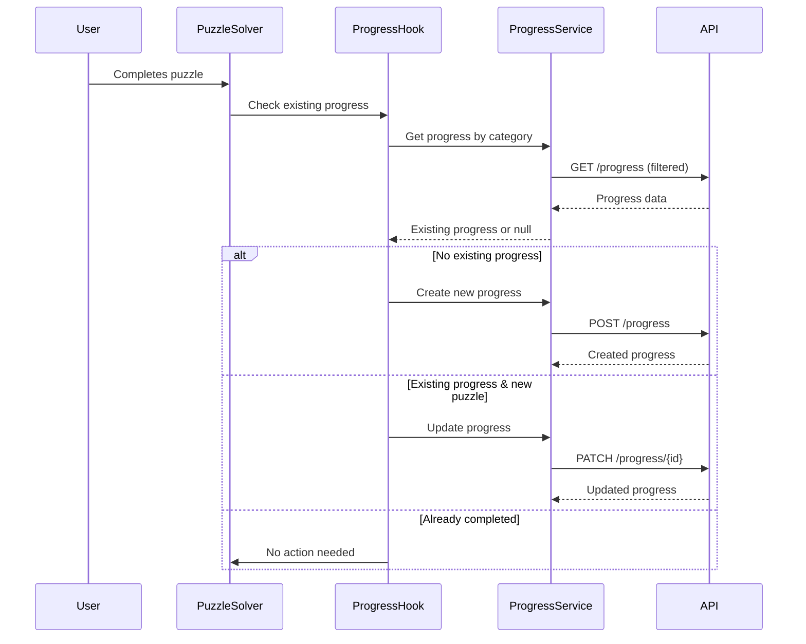

# Design Document

## Overview

The puzzle progress tracking feature integrates with the existing Redux-based progress management system to automatically save user completion status when puzzles are solved. The system leverages the existing `progressService` API and Redux store to handle both initial progress creation and updates to existing progress records.

The implementation will extend the current `PuzzleSolver` component to include progress tracking logic that determines whether to create new progress or update existing progress based on the user's completion history.

## Architecture

### High-Level Flow



### Component Integration

The progress tracking will be integrated into the existing component hierarchy:

- **PuzzleSolver**: Main component that handles puzzle completion events
- **useProgressTracking**: Custom hook that encapsulates progress logic
- **useProgress**: Existing hook for Redux progress management
- **progressService**: Existing API service for progress operations

## Components and Interfaces

### 1. Progress Tracking Hook

**File**: `src/hooks/useProgressTracking.ts`

```typescript
interface UseProgressTrackingOptions {
  categoryId: string;
  userId: string;
  type: ActivityType;
}

interface UseProgressTrackingReturn {
  trackPuzzleCompletion: (puzzleId: string) => Promise<void>;
  isLoading: boolean;
  error: string | null;
  isAlreadyCompleted: (puzzleId: string) => boolean;
}
```

This hook will:

- Check for existing progress in the specified category
- Determine if a puzzle is already completed
- Handle creation of new progress records
- Handle updates to existing progress records
- Manage loading and error states

### 2. Enhanced PuzzleSolver Component

**File**: `src/pages/PuzzleSolver/PuzzleSolver.tsx`

The existing `PuzzleSolver` component will be enhanced to:

- Initialize progress tracking on component mount
- Call progress tracking when puzzle is completed successfully
- Display progress tracking status (loading, error states)
- Show visual indicators for already completed puzzles

### 3. Progress Service Extensions

**File**: `src/api/services/progress/progressService.ts`

The existing `progressService` already provides the necessary methods:

- `createProgress()` - For initial progress creation
- `updateProgressById()` - For updating existing progress
- `getProgressByCategory()` - For checking existing progress
- `isItemCompleted()` - For checking if puzzle is already completed

### 4. Redux Store Integration

**File**: `src/store/progressSlice.ts`

The existing Redux store already handles:

- Progress state management
- API call orchestration
- Error handling
- Loading states

## Data Models

### Progress Data Structure

The existing progress data structure will be used:

```typescript
interface Progress {
  id: string;
  user: ProgressUser;
  type: ActivityType; // "tutorial"
  category: ProgressCategory; // e.g., "mate-in-one"
  completed: string[]; // Array of completed puzzle IDs
}
```

### API Request/Response Models

**Create Progress Request** (POST /progress):

```typescript
{
  userId: string;
  type: "tutorial";
  category: "mate-in-one";
  completed: ["1"];
}
```

**Update Progress Request** (PATCH /progress/{id}):

```typescript
{
  type: "tutorial";
  category: "mate-in-one";
  completed: ["1", "2"];
}
```

## Error Handling

### API Error Scenarios

1. **Network Errors**: Connection failures, timeouts
2. **Authentication Errors**: Invalid or expired tokens
3. **Validation Errors**: Invalid request data
4. **Server Errors**: 5xx responses

### Error Handling Strategy

- **Graceful Degradation**: Allow puzzle solving to continue even if progress saving fails
- **User Feedback**: Display non-intrusive error messages
- **Retry Logic**: Provide retry options for failed progress saves
- **Fallback Behavior**: Continue normal puzzle flow without blocking user

### Error UI Components

- Toast notifications for progress save failures
- Retry buttons in error states
- Visual indicators for progress sync status

## Testing Strategy

### Unit Tests

1. **useProgressTracking Hook Tests**

   - Test progress creation for new categories
   - Test progress updates for existing categories
   - Test duplicate completion prevention
   - Test error handling scenarios

2. **PuzzleSolver Integration Tests**

   - Test progress tracking on puzzle completion
   - Test UI state changes during progress operations
   - Test error state handling

3. **Progress Service Tests**
   - Test API integration with mock responses
   - Test error scenarios and edge cases
   - Test data validation

### Integration Tests

1. **End-to-End Progress Flow**

   - Complete first puzzle in category (create progress)
   - Complete additional puzzles (update progress)
   - Attempt to complete already completed puzzle (no API call)

2. **Error Recovery Tests**
   - Network failure during progress save
   - Invalid response handling
   - Retry functionality

### Manual Testing Scenarios

1. **New User Journey**

   - First puzzle completion in category
   - Verify POST /progress API call
   - Verify progress appears in Redux store

2. **Existing User Journey**

   - Complete new puzzle with existing progress
   - Verify PATCH /progress/{id} API call
   - Verify updated progress in Redux store

3. **Edge Cases**
   - Complete already completed puzzle
   - Network disconnection scenarios
   - Multiple rapid completions

## Performance Considerations

### Optimization Strategies

1. **Progress Caching**: Leverage existing Redux store for progress data
2. **Debounced API Calls**: Prevent rapid successive API calls
3. **Background Processing**: Non-blocking progress saves
4. **Selective Updates**: Only update progress when necessary

### Memory Management

- Use existing Redux selectors for efficient data access
- Avoid unnecessary re-renders during progress operations
- Clean up progress tracking resources on component unmount

## Security Considerations

### Data Validation

- Validate puzzle IDs before adding to completed array
- Validate category and type parameters
- Sanitize user input data

### Authentication

- Leverage existing authentication system
- Ensure progress operations require valid user session
- Handle authentication errors gracefully

### Authorization

- Verify user can modify their own progress
- Prevent unauthorized progress modifications
- Validate user ownership of progress records

## Implementation Phases

### Phase 1: Core Progress Tracking Hook

- Create `useProgressTracking` hook
- Implement progress detection logic
- Add basic error handling

### Phase 2: PuzzleSolver Integration

- Integrate progress tracking into PuzzleSolver
- Add progress tracking on puzzle completion
- Implement loading and error states

### Phase 3: UI Enhancements

- Add visual indicators for completed puzzles
- Implement error notifications
- Add retry functionality

### Phase 4: Testing and Optimization

- Comprehensive testing suite
- Performance optimization
- Error handling refinement
