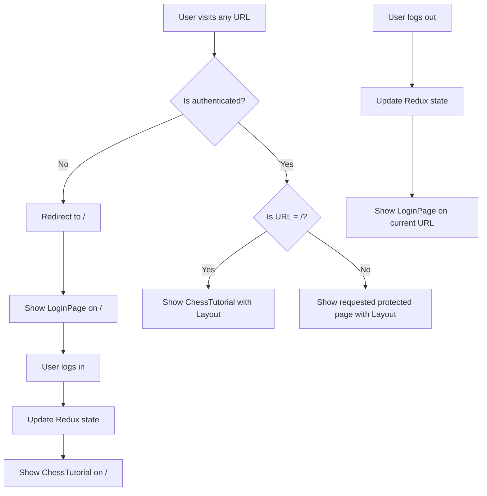

# Design Document

## Overview

This design outlines the restructuring of the application's routing system to consolidate authentication handling on the root path "/". The current implementation uses separate routes for login ("/login") and the main application ("/"), requiring complex redirect logic. The new design simplifies this by making the root route conditionally render either LoginPage or ChessTutorial based on authentication state.

## Architecture

### Current Architecture Issues

The current routing system has several complexity points:

- Separate `/login` route with `LoginRoute` component that handles authentication checks
- `ProtectedRoute` component that redirects to `/login` for unauthenticated users
- Complex navigation logic between login and main application states
- Redundant authentication state checks in multiple components

### New Architecture

The redesigned architecture will:

- Use a single root route "/" that conditionally renders based on authentication state
- Eliminate the separate "/login" route entirely
- Simplify the `ProtectedRoute` component to redirect to "/" instead of "/login"
- Centralize authentication state handling in the root route component

## Components and Interfaces

### Modified Components

#### 1. Root Route Component (New)

```typescript
interface RootRouteProps {}

// This component will be created to handle the conditional rendering
function RootRoute(): React.ReactElement {
  const { isAuthenticated, loading } = useSelector(
    (state: RootState) => state.settings
  );

  if (loading) {
    return <Loader />; // Show loading state while checking authentication
  }

  if (!isAuthenticated) {
    return <LoginPage />;
  }

  return (
    <Layout>
      <ChessTutorial />
    </Layout>
  );
}
```

#### 2. Updated ProtectedRoute Component

```typescript
interface ProtectedRouteProps {
  children: React.ReactElement;
}

function ProtectedRoute({ children }: ProtectedRouteProps): React.ReactElement {
  const { isAuthenticated } = useSelector((state: RootState) => state.settings);

  if (!isAuthenticated) {
    return <Navigate to="/" replace />; // Changed from "/login" to "/"
  }

  return <Layout>{children}</Layout>;
}
```

#### 3. Router Configuration Changes

The router configuration will be updated to:

- Remove the "/login" route entirely
- Replace the current "/" route with the new `RootRoute` component
- Update all protected routes to use the simplified `ProtectedRoute`

### Removed Components

#### LoginRoute Component

This component will be completely removed as its functionality is absorbed into the new `RootRoute` component.

## Data Models

### Authentication State Flow

```typescript
// Redux state remains the same
interface SettingsState {
  language: string;
  chessSet: string;
  user?: User;
  isAuthenticated: boolean;
  loading: boolean;
  error?: string;
}
```

### Navigation Flow



## Error Handling

### Authentication Errors

- Login failures will be handled by the LoginPage component as currently implemented
- Token refresh failures will trigger logout and show LoginPage on "/"
- Network errors during authentication will show appropriate error messages

### Navigation Errors

- Invalid routes will redirect to "/" (existing wildcard route behavior)
- Protected route access without authentication will redirect to "/" with LoginPage
- Browser back/forward navigation will respect authentication state

### Loading States

- Initial app load will show loading indicator while checking authentication state
- Login process will show loading state within LoginPage
- Route transitions will be smooth without intermediate loading states

## Testing Strategy

### Unit Tests

1. **RootRoute Component Tests**

   - Test rendering LoginPage when unauthenticated
   - Test rendering ChessTutorial when authenticated
   - Test loading state display
   - Test Redux state integration

2. **Updated ProtectedRoute Tests**

   - Test redirect to "/" when unauthenticated
   - Test rendering protected content when authenticated
   - Test Layout wrapper inclusion

3. **Router Configuration Tests**
   - Test route resolution for "/"
   - Test protected route redirects
   - Test wildcard route behavior

### Integration Tests

1. **Authentication Flow Tests**

   - Test complete login flow from "/"
   - Test logout flow and return to LoginPage
   - Test token refresh scenarios
   - Test browser refresh behavior

2. **Navigation Tests**
   - Test direct URL access for protected routes
   - Test browser back/forward navigation
   - Test bookmark access scenarios

### End-to-End Tests

1. **User Journey Tests**
   - Test unauthenticated user accessing application
   - Test authenticated user navigation
   - Test session persistence across browser restarts
   - Test logout and re-login flow

## Performance Considerations

### Bundle Size

- Removing LoginRoute component reduces bundle size slightly
- Consolidating authentication logic reduces code duplication

### Rendering Performance

- Conditional rendering in RootRoute is more efficient than route-based redirects
- Eliminates unnecessary route changes and component unmounting/mounting

### Memory Usage

- Simplified component tree reduces memory overhead
- Fewer route components in memory simultaneously

## Security Considerations

### Authentication State Protection

- Authentication state checks remain in Redux with proper validation
- Token management continues to use existing secure tokenManager service
- No changes to actual authentication mechanisms

### Route Protection

- All protected routes maintain their security through ProtectedRoute component
- Direct URL access to protected routes still requires authentication
- No security regression from current implementation

## Migration Strategy

### Phase 1: Component Updates

1. Create new RootRoute component
2. Update ProtectedRoute component redirect logic
3. Update router configuration

### Phase 2: Testing and Validation

1. Run comprehensive test suite
2. Validate all authentication flows
3. Test edge cases and error scenarios

### Phase 3: Cleanup

1. Remove LoginRoute component
2. Remove unused imports and references
3. Update any documentation or comments

### Rollback Plan

If issues arise, the changes can be easily reverted by:

1. Restoring the "/login" route
2. Reverting ProtectedRoute redirect logic
3. Restoring LoginRoute component
4. Reverting router configuration

The changes are isolated and don't affect core authentication logic, making rollback straightforward.
